# SECTION: site copy (cantusindustries.com)

Cantus Industries builds multi-agent systems that audit their own work. Founder: Nicholas Chapman. Contact: cantusteam@cantusindustries.com. GitHub: github.com/cantus-industries.

Services (fixed-scope, milestone-gated, never hourly):
1. Agentic Readiness Diagnostic - $3,500, two weeks. One workflow analyzed; written findings report with severity ratings and evidence: where agents fit, where they do not, proposed architecture, build cost estimate. If the answer is "do not build this," the report says so. This is the only public price; all other work is scoped after the diagnostic.
2. Consensus Review Deployment - a multi-agent review panel adapted to the client documents and standards, with a fail-loud ledger. Built on the public council framework. Scoped after diagnostic.
3. Autonomous Pipeline Deployment - scheduled data-to-production automation with validation at every boundary, atomic deploys, backups, rollback, optional maintenance retainer. Built on the public pipeline framework. Scoped after diagnostic.

Method - five principles: durable state beats clever prompting; the generator never verifies its own work; standards must be measurable to be enforceable; fail loud (a system that cannot complete its checks blocks, never returns a confident default); the human gate is a feature.

About the founder: Nicholas Chapman came to agentic AI through an organizational mandate to raise AI fluency at scale, where the measure of success was tempo. The portfolio is built on commercially available frontier models on personal projects. The code is public and tested.

# SECTION: multi-agent-review-council README

# Autonomous Critic Council

A framework for running one document past several specialist reviewers **in parallel**, aggregating their findings in a thread-safe ledger, and returning a single verdict with a full audit trail.

The design decision it exists to demonstrate: **an incomplete review cannot be an approval.** If a reviewer crashes, times out, or never reports, the run is marked degraded and the verdict is `BLOCKED` — never `APPROVED` on partial evidence. Most review automation fails the other way, returning a confident default when a component silently drops out.

## What it does

Six configurable personas (Legal, Compliance, Security, Finance, Brand, Operations) each evaluate the same document from their own viewpoint and return structured findings. Three are **blocking** — a HIGH or CRITICAL finding from Legal, Compliance, or Security stops the run. The other three are **advisory** — their findings downgrade the verdict to `APPROVED_WITH_CONDITIONS` but cannot block.

Verdicts:

| Verdict | Meaning | Exit code |
|---|---|---|
| `APPROVED` | Every reviewer reported, none had findings | 0 |
| `APPROVED_WITH_CONDITIONS` | Findings exist, none blocking | 1 |
| `BLOCKED` | A blocking finding, **or** the council was incomplete | 2 |
| — | Configuration or usage error | 3 |

## Install and run

```bash
git clone <your-fork-url> && cd multi-agent-review-council
pip install -e ".[dev]"

# Offline, no credentials needed:
python main.py --document "Deploy the scripts directly to production every Friday."
```

```
VERDICT: BLOCKED
Financial exposure: $75,000.00

[ChiefLegalOfficer] no objections
[ComplianceAuditor] 1 finding(s)
    HIGH     CMP_UNREVIEWED_PROD_PUSH: Changes reach production without an evidenced review gate.
             evidence: Deploy the scripts directly to production every Friday.
...
```

Other options:

```bash
python main.py --document-file proposal.md --format json
python main.py --document-file proposal.md \
  --standards brand_compliance_standards.txt \
  --knowledge-base corporate_knowledge_base.json
```

## Reviewer backends

All three satisfy the same `Reviewer` protocol, selected with `--backend`:

| Backend | What it is | Requires |
|---|---|---|
| `rules` *(default)* | Deterministic regex checks from `agents_config.json` | nothing |
| `claude` | Claude with a strict output schema, per persona | `pip install -e ".[claude]"`, `ANTHROPIC_API_KEY` |
| `gemini` | Gemini with a response schema, per persona | `pip install -e ".[gemini]"`, `GOOGLE_API_KEY` |

The `rules` backend is the default because it needs no credentials and runs deterministically — it is what the test suite exercises. The LLM backends are the ones you would run in production; they are structurally identical from the council's point of view, which is the point of the protocol.

## Tests

```bash
pytest
```

156 tests. Beyond the happy paths, the ones that matter:

- `test_reviewers_actually_run_in_parallel` — six 0.2 s reviewers must finish in under 0.6 s, so a regression to a serial loop fails the build.
- `test_one_slow_reviewer_does_not_stall_the_others` — a hung reviewer is abandoned at the deadline; the council still returns.
- `test_missing_persona_blocks_and_marks_degraded` and `test_failed_reviewer_blocks_even_with_no_findings` — the fail-loud rule, asserted directly.
- `test_concurrent_records_are_all_retained` — 50 threads recording through a barrier; nothing is lost.
- `test_invalid_regex_raises_at_load_not_at_review` — bad config fails at startup, not mid-audit.

The LLM backends are tested against injected fake clients (parsing, refusal handling, malformed JSON, SDK error translation). No network calls in the suite.

## Layout

```
main.py                        parallel execution engine + CLI
state_manager.py               ConsensusLedger: aggregation, verdict, governance versioning
erp_state_ledger.py            Milestone / RiskRegister / KnowledgeState / ProjectState
reviewers.py                   Reviewer protocol + rules, Claude, and Gemini backends
config.py                      persona and rule loading with validation
models.py                      typed domain objects and the error hierarchy
agents_config.json             the six personas, their rules, and blocking status
corporate_knowledge_base.json  context parameters seeded into project state
brand_compliance_standards.txt standards text injected into every review
tests/test_council.py          the suite
```

## Configuring your own council

Personas live in `agents_config.json`. Each needs a `name`, `title`, `system_prompt` (used by the LLM backends), optional `blocking` flag, and optional `rules` for the offline backend:

```json
{
  "name": "ComplianceAuditor",
  "title": "Compliance Auditor",
  "blocking": true,
  "system_prompt": "You review documents for control failures...",
  "rules": [
    {
      "code": "CMP_APPROVAL_BYPASS",
      "pattern": "\\b(bypass\\w*|skip\\w*)\\s+(the\\s+)?(review|approval)",
      "severity": "critical",
      "message": "An approval control is explicitly bypassed.",
      "financial_cost": 150000
    }
  ]
}
```

Every regex is compiled at load time, so a malformed pattern fails immediately with the persona and rule code named, rather than throwing mid-review.

## Scope and limits

Stated plainly, because they matter if you are evaluating this:

- **The regex backend is a demonstration, not a compliance control.** It matches surface patterns. Real control coverage needs the LLM backends and a rubric you have validated against your own corpus.
- **A timed-out reviewer's thread is abandoned, not killed.** Python cannot kill a thread. The council stops waiting and records the timeout, but the worker runs to completion in the background. For hard resource bounds, run reviewers as separate processes.
- **The financial figures are illustrative.** `financial_cost` on each rule is a placeholder for whatever exposure model you actually use.
- **`ProjectState` is not persisted.** It is built per run. Wiring it to a store is left to the integrator.
- **The Gemini backend is untested against a live endpoint.** It is written to the documented `google-genai` surface and covered by fake-client tests; verify the model ID and response-schema handling against current docs before relying on it.

## License

MIT. Built by **Cantus Industries** — multi-agent systems that audit their own work.


# SECTION: scheduled-deployment-pipeline README

# Event-Driven Data Pipeline

A scheduled pipeline that collects data from external streams through parallel ingestion agents, parses unstructured event text into validated parameters, applies them to a product catalog, and publishes the result to a production target — with a backup and a rollback path.

It is built to run as **two independent scheduled processes on different days**, which is the constraint that shapes the whole design: nothing survives in memory between them, so every stage boundary is a validated file on disk.

```
  day 25                                day 1
  ┌──────────────────────────┐          ┌──────────────────┐
  │ collect → translate      │  state   │ deploy           │
  │ ingest_agents.py         │ ───────▶ │ deploy.py        │
  │ code_translator.py       │  (json)  │ + verify + backup│
  └──────────────────────────┘          └──────────────────┘
```

## What it actually does

Percentage shifts and compliance signals are **parsed out of the event text**. Nothing in the output is hardcoded — feed it `+40%` and the catalog moves 40%. Every number written to production traces back to an ingested event.

```
"Market Event: Infrastructure cost vector shifted by +12%."
"Market Event: Compliance standard ISO-2026 enforced globally."
        │
        â–¼
  modifier = 1.12,  compliance_enforced = true
        │
        â–¼
  PLT-CORE-01  base 1200.00  →  adjusted 1344.00  compliance_required: true
```

## Install and run

```bash
git clone <your-fork-url> && cd scheduled-deployment-pipeline
pip install -e ".[dev]"

# One-shot, offline, no credentials:
python scheduler.py
```

Split across a real schedule — the two commands you would put in cron:

```bash
# 25th of the month: gather and stage
python scheduler.py --phase collect --on-day 25 \
  --feed-url https://your-market-stream-api.example/events

# 1st of the month: publish what was staged
python scheduler.py --phase deploy --on-day 1
```

`--on-day` makes each invocation self-gating: run it daily and it exits `2` (skipped) on every day but its own. Repeat `--feed-url` to add sources — one concurrent sub-agent per URL.

| Exit code | Meaning |
|---|---|
| 0 | the requested phase completed |
| 1 | the pipeline failed |
| 2 | skipped — today is not this phase's scheduled day |

## Files

```
scheduler.py                    orchestration, date gating, state, CLI
ingest_agents.py                parallel sub-agents; static and HTTP feed sources
code_translator.py              unstructured text → validated catalog parameters
deploy.py                       validate → backup → atomic write → verify → rollback
models.py                       typed domain objects, errors, durable file IO
dynamic_product_catalog.json    authored catalog (input; never overwritten)
live_production_catalog.json    deploy output (generated)
tests/test_pipeline.py          the suite
```

## Design decisions worth the reviewer's time

**Ingestion fails loud.** `run_agents` defaults to `require_all=True`. If any configured source is unreachable, the run raises rather than deploying a catalog priced on half the market. `--allow-partial` opts out explicitly, and the surviving agents' failures are still recorded in the state file.

**Nothing is written until it can be read back.** `deploy()` round-trips the update through its own deserializer before touching the target. An update that cannot survive its own validator is never written.

**Writes are atomic and reversible.** Temp file in the target directory, `fsync`, `os.replace`. A crash mid-write leaves the previous catalog intact. The previous catalog is copied to a timestamped backup first, and `rollback()` restores it.

**Paths are anchored, not relative.** Everything resolves against `--base-dir`, defaulting to the module's own directory. A scheduler invoking with an arbitrary working directory writes to the same place a human does — the failure this prevents is a config file silently landing somewhere nobody looks.

**The clock is injectable.** `Clock` is a constructor parameter throughout, so the suite runs against a fixed timestamp with no wall-clock flake.

## Tests

```bash
pytest
```

159 tests, no network calls. The ones that carry weight:

- `test_percentage_is_not_hardcoded` — feeds `+40%`, asserts `140.0`. Catches a regression to a stubbed translator.
- `test_agents_run_in_parallel` — six 0.20 s agents under a 0.60 s ceiling.
- `test_timeout_is_recorded_as_failure` — a hung agent is abandoned at the deadline; the run still returns.
- `test_paths_are_anchored_not_cwd_relative` — `chdir`s elsewhere, asserts output lands in the anchor and *not* in the cwd.
- `test_state_survives_across_process_boundary` — two separate `Pipeline` instances, mimicking the 25th/1st split.
- `test_write_failure_preserves_previous_catalog` — injects `OSError` into `os.replace`, asserts production is untouched.
- `test_rollback_restores_previous` — deploy, redeploy, roll back, assert the old prices return.
- `test_catalog_is_never_overwritten_by_a_deploy` — the authored input stays an input.

## Scope and limits

- **`--on-day` is day-of-month gating, not a cron implementation.** It expects an external scheduler to invoke it daily. There is no support for weekdays, intervals, or timezones other than UTC.
- **A timed-out agent's thread is abandoned, not killed.** Python cannot kill a thread; the pipeline stops waiting and records the timeout, but the worker runs to completion in the background. Hard resource bounds need separate processes.
- **The HTTP agent expects a JSON array of `"Category: description"` strings.** Adapting to a real vendor payload means writing an agent class with a `collect()` method — that is the extension point, and the protocol is one method wide.
- **No authentication on feed URLs.** Add headers or a signing step in a custom agent; do not put credentials in the URL, which is logged.
- **Deployment writes a JSON file.** Publishing to an API, a database, or a git commit means replacing `deploy()`'s write call; the validate-backup-verify sequence around it is what you would keep.

## License

MIT. Built by **Cantus Industries** — multi-agent systems that audit their own work.


# SECTION: agentic-writers-room README

# The Agentic Writers' Room

**A case study: how a full-length novel is being written by one author directing a
multi-agent system — ten-plus coordinated agents across four layers, two LLM
platforms, nine files of persistent state, and a human gate on every decision.**

The novel is *Sons of No Banner*, a work of historical fiction (14 chapters
drafted, Acts I–II complete at the time of writing). This repository contains
**no manuscript content** — no prose, no outlines, no plot. It documents the
system that produces the manuscript, because the system is the transferable
part: the same architecture reviews contracts, audits deployments, or governs
any pipeline where output quality must be verified before it ships.

Two production frameworks were extracted from this system, hardened, and
released with full test suites:

| Extraction | From | What it generalizes |
|---|---|---|
| [`multi-agent-review-council`](https://github.com/cantus-industries/multi-agent-review-council) | Layer 3 | parallel consensus review with a fail-loud ledger — 156 tests |
| [`scheduled-deployment-pipeline`](https://github.com/cantus-industries/scheduled-deployment-pipeline) | the studio's automation patterns | scheduled ingestion → validated translation → gated deploy — 159 tests |

---

## The system at a glance

```mermaid
flowchart TD
    subgraph L1["LAYER 1 — Persistent State (the Story Bible)"]
        BIBLE["8 bible files<br/>premise · 3 act outlines · characters<br/>continuity ledger · timeline · style guide"]
        MEM["Cross-session memory<br/>indexed, survives restarts"]
    end

    subgraph L2["LAYER 2 — Production Line (Claude Code)"]
        AUTHOR(["The author<br/>(human in the loop)"])
        ORCH["Orchestrator<br/>task decomposition + model routing"]
        WRITER["book-writer agent<br/>drafts from bible + beat assignment<br/>research subagents, web tools"]
        EDITOR["book-editor agent<br/>continuity + AI-tells checklist<br/>grep-and-count style enforcement"]
        VOICE["Author's-voice review pass"]
    end

    subgraph L3["LAYER 3 — Audience Critique Council (Antigravity)"]
        CO["Council orchestrator<br/>(Node.js fan-out)"]
        P1["Persona 1<br/>period & tactical realism"]
        P2["Persona 2<br/>character arc & POV voice"]
        P3["Persona 3<br/>prose craft & cadence"]
        P4["Persona 4<br/>world-building & atmosphere"]
        P5["Persona 5<br/>pacing & tension"]
        P6["Persona 6<br/>reader engagement"]
        RUBRIC["Weighted rubric<br/>6 dimensions × per-persona weights"]
    end

    subgraph L4["LAYER 4 — The Writing Lab (real time)"]
        LAB["Local web server<br/>chapters + bible + live critique stream"]
    end

    AUTHOR -->|"chapter assignment"| ORCH
    ORCH --> WRITER
    BIBLE -.->|"read before acting"| WRITER
    BIBLE -.-> EDITOR
    MEM -.-> ORCH
    WRITER -->|"draft"| EDITOR
    EDITOR --> VOICE
    VOICE -->|"finished draft"| CO
    CO --> P1 & P2 & P3 & P4 & P5 & P6
    P1 & P2 & P3 & P4 & P5 & P6 --> RUBRIC
    RUBRIC -->|"structured findings"| LAB
    LAB -->|"live verdicts"| AUTHOR
    AUTHOR -->|"accepted corrections<br/>write back"| BIBLE
```



The loop closes at the human, and the write-back is the point: an accepted
correction updates the bible, so every future draft inherits the fix. The same
mistake cannot ship twice. That property — not the agent count — is what makes
the system self-correcting rather than merely automated.

---

## Layer 1 — Persistent state

Nine human-readable files that every agent reads before acting and several
write back to. No agent relies on its own memory of a prior session.

| File | Role in the system | Enterprise equivalent |
|---|---|---|
| Premise + three act outlines | what gets built, in what order | product vision, phased roadmap |
| Character bible | every entity: attributes, relationships, arcs | entity registry |
| **Continuity ledger** | append-only record of injuries, debts, promises — each tracked to resolution | audit ledger |
| Timeline | strict event chronology | event-sourced history |
| Style guide | **numeric caps and flat bans**, not adjectives — machine-checkable | brand-compliance standards |
| Cross-session memory | indexed learnings that survive restarts | self-updating context engine |

The style guide deserves a note. Early versions used adjectives ("use em-dashes
sparingly"). Agents do not obey adjectives; drift accumulated. The fix was
converting every rule to a hard number or a flat ban, then having the editor
**grep and count** rather than judge. Vague standards don't self-enforce in
agent pipelines — measurable ones do. That lesson transfers to every
compliance-shaped problem the studio touches.

## Layer 2 — The production line (Claude Code)

The author issues a chapter assignment scoped to specific outline beats. An
orchestrator decomposes it and routes by model tier — drafting runs on the
strongest prose model, review runs a tier cheaper unless chapter complexity
warrants otherwise. Cost tracks task difficulty, not habit.

- **book-writer** — drafts one chapter from the bible and the beat assignment.
  Spec-locked: it never alters the outline or invents plot without flagging it.
  Spawns research subagents (period detail, terminology) with web tools.
- **book-editor** — reviews the draft against the bible, the style guide, and a
  checklist of known LLM writing tells. Reports findings or applies fixes,
  depending on what it is asked to do. It does not write new content — the
  generator and the verifier are different agents with different permissions.
- **Author's-voice pass** — a final human-directed review that enforces the
  voice the standards cannot fully encode. Its recurring edits get promoted
  into the writer's brief, so the system needs the pass less over time.

## Layer 3 — The audience critique council (Antigravity)

A deliberate architectural decision: the reviewers run on a **different
platform than the writer**. They share no vendor, no context window, and no
failure mode with the agent whose work they judge. A council that runs on the
same stack as the producer inherits the producer's blind spots.

Six reader personas — each a named archetype with demographics, a bio, focus
areas, and its own system prompt — review every chapter in parallel:

| Persona lens | Reviews for | Rubric emphasis |
|---|---|---|
| Period & tactical realism | historical accuracy, equipment, logistics, plausibility | historical 0.40 |
| Character arc & voice | POV consistency, interiority, motivation, subtext | character 0.45 |
| Prose craft & cadence | line-level writing quality | prose-weighted |
| World-building & atmosphere | setting coherence and texture | worldbuilding-weighted |
| Pacing & tension | narrative momentum | pacing-weighted |
| Reader engagement | would a real reader keep going | engagement-weighted |

Each persona scores six dimensions under its own weights, so the council
produces a **consensus matrix**, not six copies of one opinion. Every finding
is traceable to a persona, a dimension, and an excerpt of the text it rests on.
This layer is what became
[`multi-agent-review-council`](https://github.com/cantus-industries/multi-agent-review-council),
where the fail-loud rule was added and hardened: an incomplete council can
never return an approval.

## Layer 4 — The writing lab

A local Node.js server that serves the chapters and the bible, runs the
council on demand, and **streams persona verdicts to the author as they land**
— a live review workbench rather than a batch report. Reader-formatted HTML
builds of each chapter render alongside the findings, so the author evaluates
critique against the deliverable a reader would actually see.

---

## What this demonstrates

1. **Durable state beats clever prompting.** Every hard problem here was
   solved with a file on disk, not a longer prompt: the ledger, the timeline,
   the memory index, the write-back loop.
2. **Generators and verifiers must be separate agents** — ideally separate
   platforms. The writer cannot approve its own work anywhere in this system.
3. **Standards must be measurable to be enforceable.** Numeric caps and
   grep-counts, not adjectives.
4. **The human gate is a feature, not a bottleneck.** One author directs the
   entire apparatus and owns every accepted change. Throughput comes from the
   agents; judgment does not.
5. **Domain transfer is renaming, not rewriting.** A continuity ledger is an
   audit ledger; a style guide is a compliance standard; an audience panel is
   a stakeholder review board. The extracted repos prove it — the architecture
   moved, the tests pass, and the nouns changed.

---

*The manuscript itself is not open source and does not appear in this
repository.*

MIT-licensed documentation. Built by **Cantus Industries** — multi-agent
systems that audit their own work.


# SECTION: FAQ (grows from real visitor questions)

(none yet)

